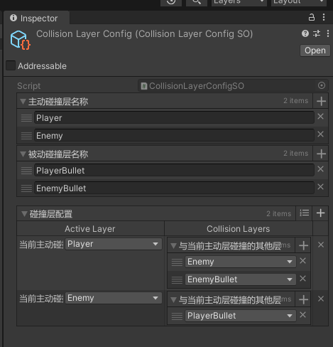
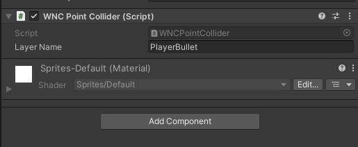

# WorldUnitCollision2DSystem

## 当前版本不依赖Odin Inspector运行，会缺少对CollisionLayerConfigSO的校验，请仔细阅读相关部分的文档。

WorldUnitCollision2DSystem 是一个基于网格的2D碰撞检测系统。它通过一系列使用限制，来换取在碰撞检测上的性能提升。

一般情况下可以满足同屏2000 - 3000个碰撞体之间的碰撞检测需求。

## 快速开始

直接运行Example文件夹下的内容，或者遵循以下步骤。

1. 从Example文件夹中，将 `WorldUnitCollisionSystem` 预制体 拖入到你的场景中。
2. 为你的敌人添加 `WNCBoxCollider` 组件，并设置 `LayerName` 为 `Enemy`。
3. 为你的玩家子弹添加 `WNCPointCollider` 组件，并设置 `LayerName` 为 `PlayerBullet`。
4. 查看后续内容，学会编辑碰撞层配置文件。

## CollisionLayerConfigSO碰撞层配置文件

碰撞层配置文件是一个 `ScriptableObject`，用来配置碰撞层之间的碰撞关系。

### 主动碰撞层

主动碰撞层会在检测到碰撞后，触发自身的OnTrigger方法。在两个相互碰撞的层级之间，你应该选择数量较少的那一个作为主动碰撞层，以减少计算量。

例如，在一个弹幕地狱游戏中，有很多子弹和较少的敌人，那么你应该选择敌人所在的层级作为主动碰撞层。反之，如果有很多敌人，而子弹较少，那么你应该选择子弹所在的层级作为主动碰撞层。

### 被动碰撞层

被动碰撞层不会触发OnTrigger方法，但是当它被其他主动碰撞层碰撞时，会触发其他主动碰撞层的OnTrigger方法。

### 碰撞层配置

通过ActiveLayer字段设置一个主动碰撞层，通过CollisionLayers字段，设置可以与它碰撞的其他碰撞层（这个碰撞层可以是主动碰撞层，也可以是被动碰撞层）。

## WorldUnitCollision2DSystem

WorldUnitCollision2DSystem是负责碰撞检测的核心系统。它通过将空间拆分成一个个网格，并只对在同一个网格中的物体进行碰撞检测，从而减少了碰撞检测的次数。

长时间未存在碰撞物体的网格会自动回收，你可以自己调整网格大小和网格存活时间，来获取最好的效果。但一般情况下，你只需要拖入CollisionLayerConfigSO（碰撞层配置文件）来配置碰撞层，其他保持默认即可。

通过showDebugInfo字段，可以开启或者关闭调试信息。调试信息开启的状态如下。每个网格的左下角表示当前网格的索引（为Vector2Int类型），右下角表示当前网格的碰撞物体数量。

 

## 碰撞器

### 注意：点碰撞器与点碰撞器之间不会发生碰撞。

碰撞器通过一个名为OnTrigger的Action来触发碰撞检测。你可以在其他组件中获取碰撞器，并订阅OnTrigger来处理碰撞后的逻辑。

详细内容可以参考 `Example` 文件夹下的 `Enemy` 脚本。

### 点碰撞器

在很多射击游戏中，子弹的体积较小，可以近似看作一个点。在不要求高精度碰撞检测的情况下，推荐使用点碰撞器来检测子弹与敌人之间的碰撞。

点状碰撞器拥有最好的性能，如果有可能，请尽量使用点碰撞器来处理较小体积的碰撞物体。

使用点状碰撞器只需要设置LayerName字段即可。

### 矩形碰撞器

矩形碰撞器拥有较好的性能，同时支持旋转，可以处理大多数情况下的碰撞检测需求。

通过Width和Height字段，可以设置矩形碰撞器的尺寸。
通过Offset字段，可以调整矩形碰撞器的位置。    

你可以通过unity Editor中的绿色方框，来直观地看到碰撞器的位置和尺寸。

### 其他碰撞器

在我看来矩形碰撞器可以满足绝大多数需求。其他碰撞器使用的场景较小，同时也会耗费更高的性能开销。如果你真的有需求可以通过issue进行反馈。